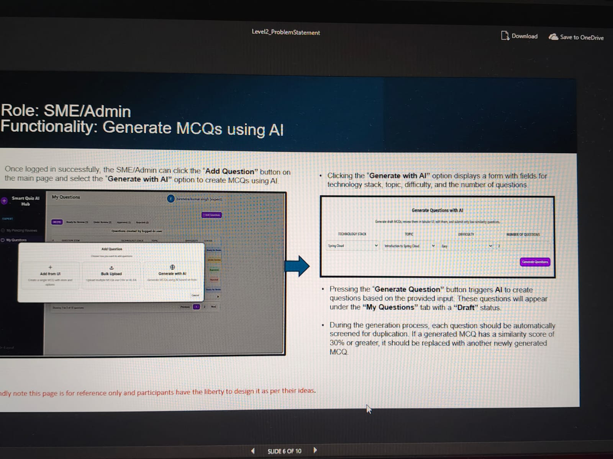
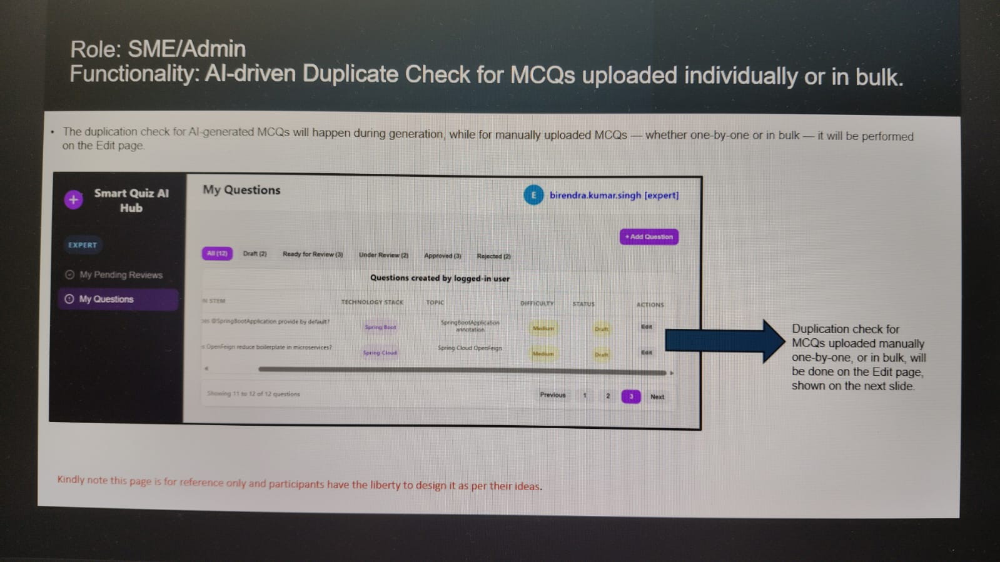
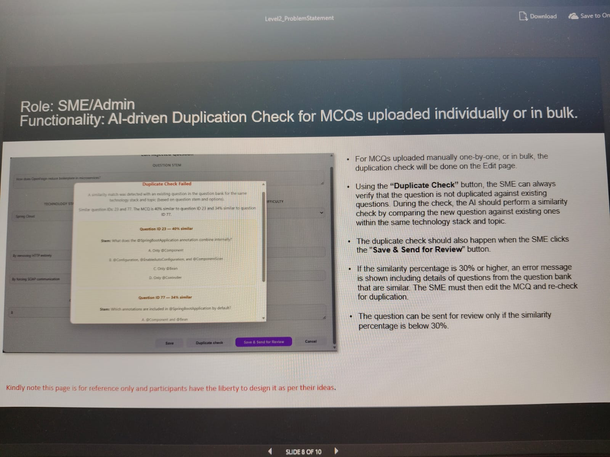

Problem statement

The objective of Level 2 is to significantly reduce manual effort for Subject Matter Experts (SMEs) by leveraging Artificial Intelligence (AI) to streamline the creation, management, and optimization of the MCQ repository. This phase focuses on transforming the platform into an intelligent, scalable, and automated system through:

Al-driven content generation

Automated duplicate detection

Key Capabilities (SME Experience)

Al-Powered Question Generation: Generate questions dynamically based on user-defined inputs such as topic and difficulty level, ensuring consistency and scalability.

Automated Duplicate & Similarity Detection: Identify duplicate or semantically similar questions, using similarity scoring, reducing redundancy.

Once logged in successfully, the SME/Admin can click the "Add Question" button on the main page and select the "Generate with Al" option to create MCQs using Al

Smart Quiz Al Hab

My Questions

ت

Generate with Al

Clicking the "Generate with Al" option displays a form with fields for technology stack, topic, difficulty, and the number of questions.

Generate Questions with Al

DFFICIALTY

TECHNOLOGY STACE

HUNDER OF QUESTIONS

Pressing the "Generate Question" button triggers Al to create questions based on the provided input. These questions will appear under the "My Questions" tab with a "Draft" status.

During the generation process, each question should be automatically screened for duplication. If a generated MCQ has a similarity score of 30% or greater, it should be replaced with another newly generated MCQ

The duplication check for Al-generated MCQs will happen during generation, while for manually uploaded MCQs on the Edit page

whether one-by-one or in bulk

it will be performed

Smart Quiz Al Hub

My Questions

birendra kumar singh (expert]

EXPERT

My Pending Reviews

Questions created by logged in user

NSTEM

TECHNOLOGY

My Questions

Approved

Duplication check for MCQs uploaded manually one-by-one, or in bulk, will be done on the Edit page, shown on the next slide

Role: SME/Admin Functionality: Al-driven Duplication Check for MCQs uploaded individually or in bulk.

QUESTION STEM

Duplicate Check Failed

TECHNOLOGY ED

A similarity match was detected with an existing question in the question bank for the same technology stack and topic based on question stern and option

Similar question : 23 and 77. The MCQ is 40% similar to question ID 23 and 34% similar to question ID 77.

Question ID 23-40% similar

Stem: What does the SpringBootApplication annotation combine internally

A. Omy Component

gration and Componenticam

C Orly Stein

D. Only Controller

Question ID 77-34% similar

which ations are included in SpringApplication by defau

A Component and tran

FICULTY

Duplicate

Save & Sand for Review

Cancel

For MCQs uploaded manually one-by-one, or in bulk, the duplication check will be done on the Edit page.

Using the "Duplicate Check" button, the SME can always verify that the question is not duplicated against existing questions. During the check, the Al should perform a similarity check by comparing the new question against existing ones within the same technology stack and topic.

The duplicate check should also happen when the SME clicks the "Save & Send for Review" button.

If the similarity percentage is 30% or higher, an error message is shown including details of questions from the question bank that are similar. The SME must then edit the MCQ and re-check for duplication.

The question can be sent for review only if the similarity percentage is below 30%.

Future Scope

Future enhancements of the application include enabling quizzes during training sessions to improve participant engagement.

Leaderboards can be integrated to encourage healthy competition and track user progress.

Adaptive learning algorithms can be implemented to personalize quiz difficulty based on individual user performance.

Analytics features can be incorporated to provide detailed insights into user engagement and identify knowledge gaps.

Mobile compatibility can be enhanced to support on-the-go learning through smartphones and tablets.

Multilingual support can be added to accommodate a diverse user base and improve global accessibility.

Collaboration tools can be integrated to enable peer-to-peer interaction and group quiz sessions, fostering collective learning.